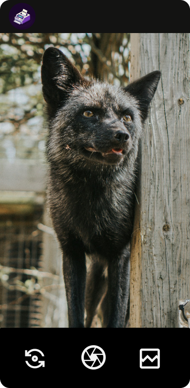

# MemeGenerator

MemeGenerator is an application that empowers users to craft memes effortlessly by incorporating text into images. Drawing inspiration from the renowned SimuladaSimulator, this app streamlines the meme creation process. Users have the option to select images from an extensive library or upload their own. Afterward, they can effortlessly append text to both the top and bottom of the image before downloading the meme to their device. Developed using React Native, this app seamlessly integrates Java modules with a bridge to Python for efficient meme creation.


## Screenshots





## Authors

- [@gab-simon](https://www.github.com/gab-simon)


## Installation

Install MemeGenerator with yarn
   
   ```bash
   yarn install my-project
   cd my-project
   ```
    
## Optimizations

What optimizations did you make in your code? E.g. refactors, performance improvements, accessibility
